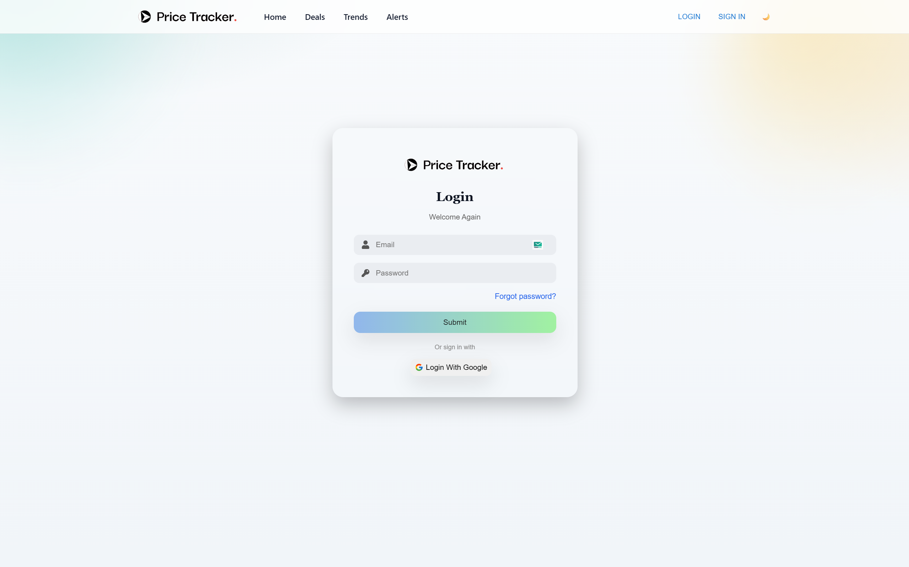
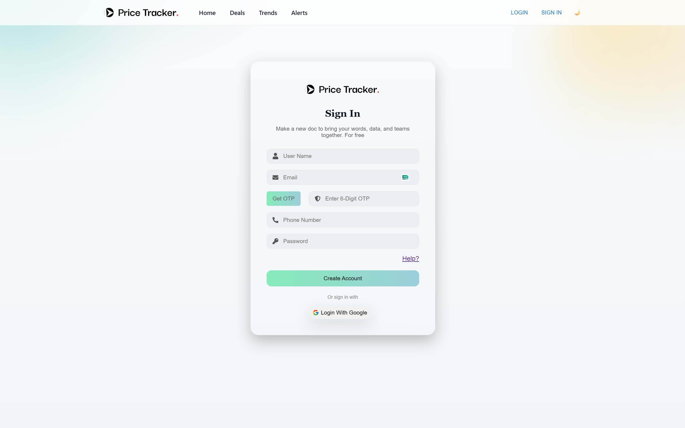
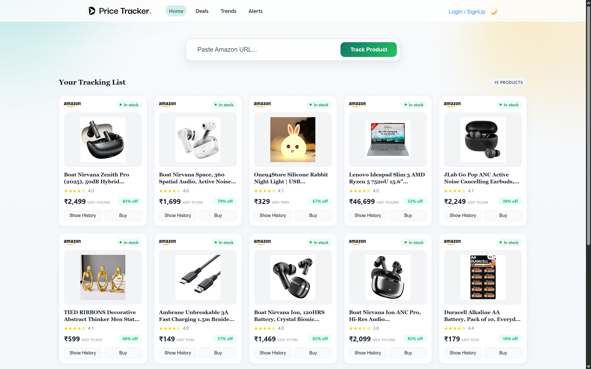
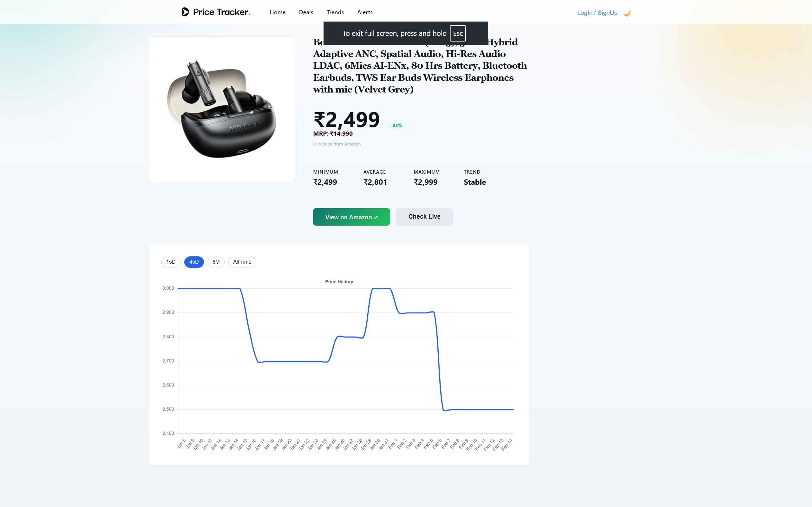

# PRICE HISTORY TRACKER

*Track Smarter, Buy Better*

[](LICENSE)
[](https://github.com/sameer-pimple/Price-History-Tracker/stargazers)
[](https://github.com/sameer-pimple/Price-History-Tracker/network)
[](https://github.com/sameer-pimple/Price-History-Tracker/issues)

Built with the tools and technologies:  

[](https://skillicons.dev)

---

## 🧭 Table of Contents

- [Overview](#overview)
- [Architecture](#architecture)
- [Core Features](#core-features)
- [Getting Started](#getting-started)
  - [Prerequisites](#prerequisites)
  - [Installation](#installation)
- [Usage](#usage)
- [API Endpoints](#api-endpoints)
- [Contributing](#contributing)
- [License](#license)
- [Contact](#contact)

---

## 📖 Overview

**Price History Tracker** is a scalable Java Full Stack application that monitors product prices across multiple e-commerce platforms and stores historical pricing data for analysis.

It integrates **platform-specific web scrapers**, **secure JWT authentication**, and a **RESTful backend architecture** to deliver reliable and structured price tracking.

### Why Price History Tracker?

This project helps users make smarter purchasing decisions by providing historical price trends and secure personalized tracking.

---

## 🏗️ Architecture

The backend follows a clean, modular architecture:

- **Controller Layer** – Handles HTTP requests & responses
- **Service Layer** – Business logic
- **Repository Layer** – Database interaction (JPA/Hibernate)
- **Entity – DTO – Mapper Pattern** – Clean separation of concerns
- **JWT Security Layer** – Authentication & authorization
- **Platform-specific Scraper Strategy** – Amazon, Flipkart, etc.

---

## 🔑 Core Features

### 🔐 JWT Authentication & Authorization
- Secure login system using JWT tokens
- Stateless authentication
- Protected APIs with Spring Security

---


### 🔐 User Authentication (Login & Register)

- Secure user registration system  
- JWT-based login authentication  
- Password encryption using Spring Security  
- Protected API routes with token validation  
- Persistent login state on frontend  




---


### 🛒 Multi-Platform Price Scraping
- Selenium-based scraping
- Platform-specific scraper implementations
- Dynamic price extraction from product URLs



---

### 📊 Price History Tracking
- Stores historical price records in MySQL
- Tracks price changes over time
- Maintains timestamped pricing data



---

### 🧩 Clean Backend Architecture
- Spring Boot
- Spring Data JPA
- Hibernate ORM
- MySQL Database
- Exception handling with structured API responses

---

### 🔄 JSON Parsing & Data Mapping
- Jackson for JSON parsing
- DTO-based response structure
- Clean API contracts

---

## 🚀 Getting Started

### Prerequisites

Make sure you have the following installed:

- **Java 17+**
- **Maven**
- **MySQL**
- **Node.js & npm** (for frontend)
- **ChromeDriver** (for Selenium scraping)

---

### Installation

#### 1️⃣ Clone the repository

```bash
git clone https://github.com/sameer-pimple/Price-History-Tracker
cd Price-History-Tracker


---

## 🗄️ Configure MySQL

Update your `application.properties` file with your database credentials:

```properties
spring.datasource.url=jdbc:mysql://localhost:3306/price_tracker
spring.datasource.username=your_username
spring.datasource.password=your_password
```

---

## 🚀 Run Backend

Start the Spring Boot application:

```bash
mvn spring-boot:run
```

Backend runs on:

```
http://localhost:8080
```

---

## 💻 Run Frontend (React)

Navigate to the frontend directory and start the React application:

```bash
cd frontend
npm install
npm start
```

Frontend runs on:

```
http://localhost:3000
```

---

## 💻 Usage

Follow these steps to use **Price History Tracker**:

1. Register a new user.  
2. Login to receive a JWT token.  
3. Add a product URL from supported platforms.  
4. The system automatically scrapes the current price.  
5. Historical prices are stored in the database.  
6. View price trends and tracking history anytime.

---

## 🔗 API Endpoints

### 🔐 Authentication

```http
POST /api/user/register
POST /api/user/login
```

---

### 📦 Product Tracking

```http
POST   /api/product/add
GET    /api/product/{id}
GET    /api/product/history/{id}
DELETE /api/product/{id}
```

---

## 🤝 Contributing

Contributions are always welcome!  
If you'd like to improve **Price History Tracker**, follow these steps 👇

1. Fork the repository  
2. Clone your fork  

```bash
git clone https://github.com/<your-username>/Price-History-Tracker.git
```

3. Create a new branch  
4. Commit your changes  
5. Push to the branch  
6. Open a Pull Request  

---

## 📜 License

This project is licensed under the **MIT License** — meaning you’re free to use, modify, and distribute this project for personal or commercial purposes.  
Just make sure to give proper credit to the original author.

📄 You can read the full license terms here: [LICENSE](./LICENSE)

---

## 📬 Contact

Have questions, feedback, or ideas for collaboration? I’d love to connect!

**👤 Author:** Sameer Pimple  
**📧 Email:** sameerpimple2002@gmail.com  
**🌐 GitHub:** [@sameer-pimple](https://github.com/sameer-pimple)  
**🔗 Project Link:** [Price History Tracker on GitHub](https://github.com/sameer-pimple/Price-History-Tracker)

---

⭐ *If you like this project, please consider giving it a star on GitHub! It really motivates me to build more amazing projects like this.*
