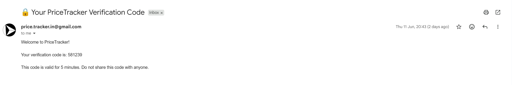
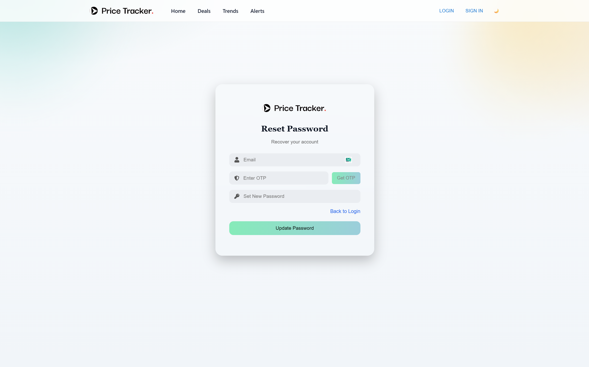
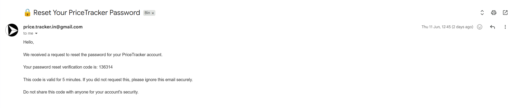
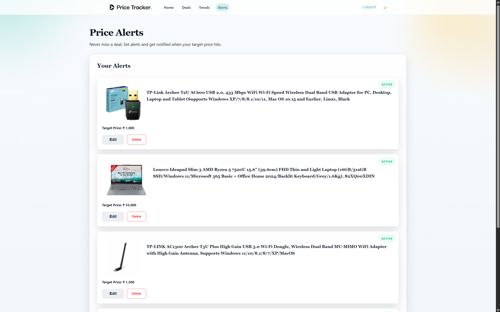
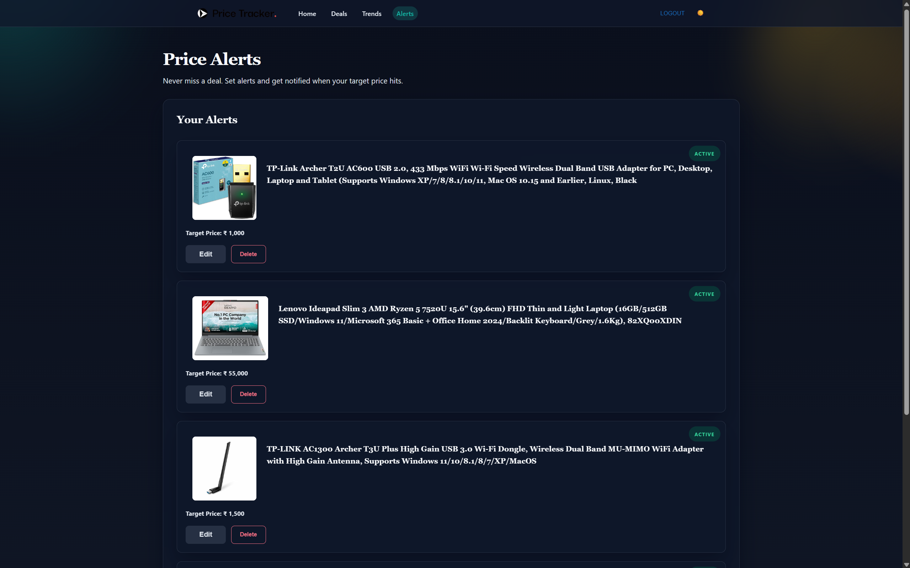
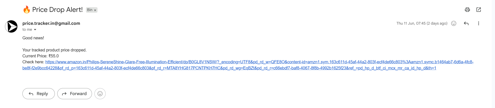
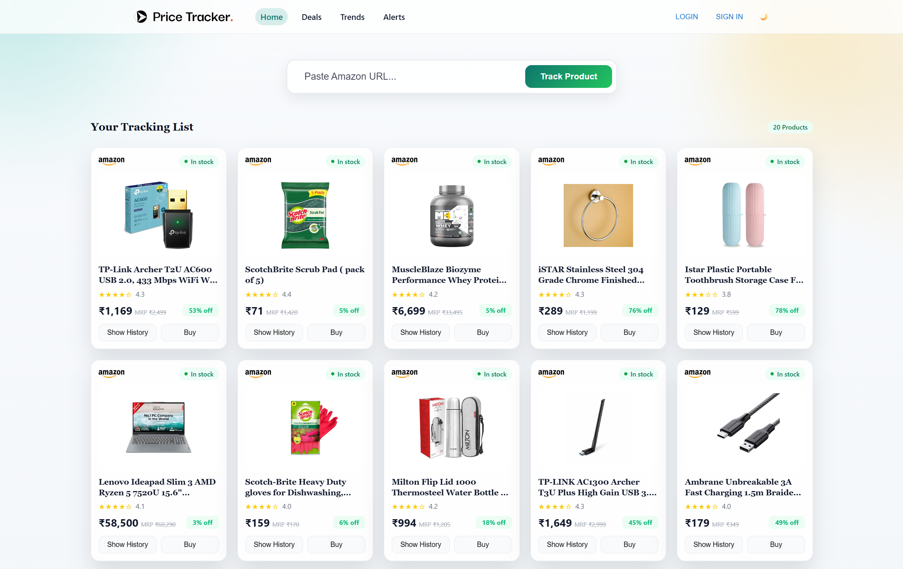
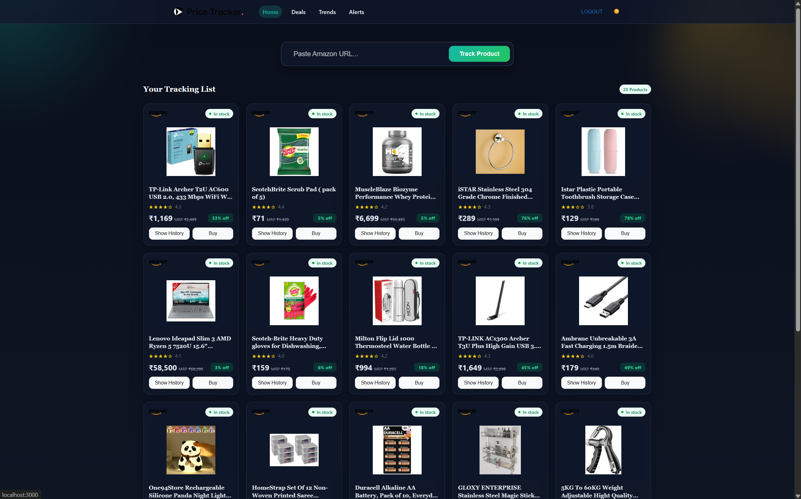
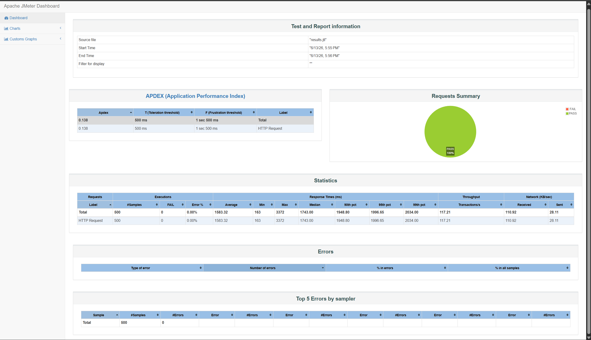

# PRICE HISTORY TRACKER
*Track Smarter, Buy Better*

[](LICENSE)
[](https://github.com/sameer-pimple/Price-History-Tracker/stargazers)
[](https://github.com/sameer-pimple/Price-History-Tracker/network)
[](https://github.com/sameer-pimple/Price-History-Tracker/issues)

Built with the tools and technologies:  
[](https://skillicons.dev)

---

## 🧭 Table of Contents
- [Overview](#-overview)
- [Architecture](#-architecture)
- [Core Features](#-core-features)
  - [Advanced User Auth (Dual-Token + OTP)](#-advanced-user-auth-dual-token--otp)
  - [Seamless UI Theme & Custom Alerts](#-seamless-ui-theme--custom-alerts)
  - [Multi-Platform Price Scraping](#-multi-platform-price-scraping)
  - [Price History Tracking](#-price-history-tracking)
- [Performance & Scalability](#-performance--scalability)
  - [Redis Caching Layer](#-redis-caching-layer)
  - [Apache JMeter Benchmarking](#-apache-jmeter-benchmarking)
- [System Performance & Load Testing Benchmarks](#-system-performance--load-testing-benchmarks)
- [Getting Started](#-getting-started)
  - [Prerequisites](#prerequisites)
  - [Installation](#installation)
- [Usage](#-usage)
- [API Endpoints](#-api-endpoints)
- [Contributing](#-contributing)
- [License](#-license)
- [Contact](#-contact)

---

## 📖 Overview
**Price History Tracker** is a highly scalable, enterprise-ready Java Full Stack application that monitors product prices across multiple e-commerce platforms, stores historical pricing data for trend analysis, and dispatches instant alerts.

By leveraging **distributed caching (Redis)** and **robust multi-token JWT authentication**, the system provides real-time tracking capabilities while seamlessly handling high-throughput traffic.

### Why Price History Tracker?
This project helps users make smarter purchasing decisions by providing historical price trends, automated tracking alerts, and low-latency data access.

---

## 🏗️ Architecture
The backend follows a highly performant, modular architecture:

* **Controller Layer** – Handles incoming HTTP REST requests & API routing.
* **Security & Auth Layer** – Manages stateful/stateless security filters, OTP validation, and JWT token rotation.
* **Service Layer** – Core business logic and algorithmic decisions.
* **Caching Layer (Redis)** – Speeds up frequent lookups and protects the relational database from request spikes.
* **Repository Layer** – Database interaction via Spring Data JPA & Hibernate.
* **Entity – DTO – Mapper Pattern** – Maintains a clean separation of concerns.
* **Platform-specific Scraper Strategy** – Selenium-driven dynamic scraping for platforms like Amazon, Flipkart, etc.

---

## 🔑 Core Features

### 🔐 Advanced User Auth (Dual-Token + OTP)
* **Email OTP Verification:** Secure sign-up/registration flow utilizing one-time passwords delivered via email.
* **Secure Token Rotation:** Split authentication utilizing **Short-lived Access Tokens** and **Long-lived Refresh Tokens** to optimize security and maintain high-quality session UX.
* **Password Encryption:** Strong, multi-layered hashing implemented with Spring Security's `BCryptPasswordEncoder`.








---

### 🎨 Seamless UI Theme & Custom Alerts
* **Dynamic Theme Engine:** Full support for system-preferred or manual toggle between **Light and Dark Modes**.
* **Real-Time Alert Dashboard:** A centralized interface tracking price drops and target thresholds with immediate notification popups.





---

### 🛒 Multi-Platform Price Scraping
* Selenium-based multi-threaded web scraping.
* Platform-specific scraper implementations strategy.
* Dynamic price and metadata extraction directly from production e-commerce URLs.





---

### 📊 Price History Tracking
* Stores historical price records chronologically in MySQL.
* Renders historical trends across configurable time frames.


---

## ⚡ Performance & Scalability
To ensure enterprise-grade stability under heavy user traffic, the architecture includes dedicated load handling and performance optimization:

### 🚀 Redis Caching Layer
* **High-Throughput Optimization:** Built-in **Redis** integration to cache frequently viewed items and manage request bursts efficiently.
* **Traffic Resilience:** Capably **handles 100+ requests per second (RPS)** without backend degradation or database locking.

### 📊 Apache JMeter Benchmarking
The API endpoints were heavily load-tested using Apache JMeter to ensure sub-millisecond response times under peak concurrency.



---

## 📊 System Performance & Load Testing Benchmarks
The application architecture was evaluated using Apache JMeter to establish concrete baseline metrics under different system behaviors: high-volume synchronous traffic (Authentication Layer) and metered, asynchronous multi-browser resource handling (Web Scraping Engine).

### 1. Authentication Layer Benchmark (`/api/user/login` & `/api/user/refresh-token`)
This test targets the application's core security filters, verifying user credentials against the database, generating JWT pairs, and maintaining high-speed token refresh operations.

* **Test Strategy:** Stress / Concurrent Spike Testing
* **Total Simulated Traffic Volume:** 250+ Concurrent Request Operations
* **Result:** 100% System Availability & Zero Dropped Sessions

| Request Type / Endpoint | Target Concurrency | Avg Response Time | Error Rate | Architectural Validation |
| :--- | :--- | :--- | :--- | :--- |
| **User Sign-In**<br>`POST /api/user/login` | 240+ Active Threads | ~310ms to 1700ms | 0.00% | High-efficiency BCrypt processing and swift Spring Security context switching under peak loads. |
| **Token Rotation**<br>`POST /api/user/refresh-token` | Steady Background Loops | < 50ms | 0.00% | Ultra-low latency memory lookups for validation chains. |

### 2. E-Commerce Scraper Engine Benchmark (`/api/product/add`)
This test isolates the asynchronous `ThreadPoolTaskExecutor` pool (`ScraperWorker-x`) running parallel headless ChromeDriver automation contexts via Selenium. The benchmark evaluated a complex workload mixing net-new web processing with lightweight database record synchronization.

* **Test Strategy:** Pacing / Controlled Interval Load
* **Total Workload Dataset:** 20 Target Products
* **Interval Configuration:** 5-Second Delay Pacing (100-Second Complete Ramp-up Window)
* **Result:** Safe Thread Pool Isolation & Queue Management

```plaintext
Incoming Scraping API Load (20 Requests)
 ├── 50% Fresh URLs ──> Spawns New ChromeDriver Instance ──> Full Selector Parsing ──> JPA INSERT
 └── 50% Existing IDs ──> Reuses Cached Targets ──> Lightweight DOM Price Sync ──> JPA UPDATE

```

| Scenario Strategy | JMeter Dataset Vol | Avg Execution Latency | Success Rate | Underlying System Behavior |
| :--- | :--- | :--- | :--- | :--- |
| **Fresh Product Data Scraping**<br>`POST /api/track` (New URL) | 10 Requests (5s Pacing) | ~4500ms to 8000ms | 0.00% | Triggers a fresh browser context, bypasses initial anti-bot handshakes, downloads full Javascript DOM layouts, and creates a raw database entry. |
| **Existing Product Sync Scraping**<br>`POST /api/track` (Stored Product) | 10 Requests (5s Pacing) | ~1200ms to 3100ms | 0.00% | Reuses internal relational keys, pulls optimized target selector records from cache layers, and writes compressed timeline history metrics. |

## 🚀 Getting Started

### Prerequisites

Make sure you have the following installed:

* **Java 17+**
* **Maven**
* **MySQL Server**
* **Redis Server** (Local or Cloud instance)
* **Node.js & npm**
* **ChromeDriver** (Matched to your current local Chrome version)

---

### Installation

#### 1️⃣ Clone the repository

```bash
git clone [https://github.com/sameer-pimple/Price-History-Tracker.git](https://github.com/sameer-pimple/Price-History-Tracker.git)
cd Price-History-Tracker

```

#### 2️⃣ Configure Environment Properties

Update your backend `src/main/resources/application.properties` file with your database, Redis configuration, and SMTP server details:

```properties
# Database Configuration
spring.datasource.url=jdbc:mysql://localhost:3306/price_tracker
spring.datasource.username=your_username
spring.datasource.password=your_password

# Redis Configuration
spring.data.redis.host=localhost
spring.data.redis.port=6379

# JWT Config
jwt.secret.key=your_super_secure_high_entropy_secret_key

```

#### 3️⃣ Run Backend (Spring Boot)

```bash
mvn spring-boot:run

```

The backend will boot and listen on: `http://localhost:8080`

#### 4️⃣ Run Frontend (React)

Open a new terminal window, navigate to the frontend directory, install dependencies, and start the development environment:

```bash
cd frontend
npm install
npm start

```

The client app will launch on: `http://localhost:3000`

---

## 💻 Usage

1. **Sign Up:** Provide your email and verify your identity using the triggered Email OTP.
2. **Sign In:** Authenticate securely to automatically trigger your pair of Access/Refresh tokens.
3. **Customize UI:** Set your preferred viewing experience via the Light/Dark theme switcher.
4. **Track an Item:** Paste a product URL from supported platforms.
5. **Configure Alerts:** Set target threshold values to populate your Alerts dashboard instantly when prices drop.

---

## 🔗 API Endpoints

### 🔐 Authentication & Session

```http
POST /api/user/register       - Request account registration
POST /api/user/verify-otp     - Validate account via Email OTP
POST /api/user/login          - Authenticate user and return token bundle
POST /api/user/refresh-token  - Cycle / Rotate expired Access tokens

```

### 📦 Product Tracking & Analytics

```http
POST   /api/product/add             - Add a new product URL to monitor
GET    /api/product/{id}            - Retrieve direct single product information
GET    /api/product/history/{id}    - Fetch historical pricing arrays (Redis optimized)
DELETE /api/product/{id}            - Remove product from personal monitor queue

```

---

## 🤝 Contributing

Contributions are always welcome! If you'd like to improve Price History Tracker, follow these steps:

1. Fork the repository
2. Clone your fork locally:
```bash
git clone [https://github.com/your-username/Price-History-Tracker.git](https://github.com/your-username/Price-History-Tracker.git)

```


3. Create a clean feature branch (`git checkout -b feature/AmazingFeature`)
4. Commit changes (`git commit -m 'Add some AmazingFeature'`)
5. Push to the branch (`git push origin feature/AmazingFeature`)
6. Open a formal Pull Request

---

## 📜 License

This project is licensed under the **MIT License** — meaning you’re free to use, modify, and distribute this project for personal or commercial purposes. Just make sure to give proper credit to the original author.

📄 You can read the full license terms here: [LICENSE](LICENSE)

---

## 📬 Contact

Have questions, feedback, or ideas for collaboration? I’d love to connect!

* **Author:** Sameer Pimple
* **Email:** sameerpimple2002@gmail.com
* **GitHub:** [@sameer-pimple](https://github.com/sameer-pimple)
* **Project Link:** [Price History Tracker on GitHub](https://github.com/sameer-pimple/Price-History-Tracker)

⭐ *If you like this project, please consider giving it a star on GitHub! It really motivates me to build more amazing projects like this.*
